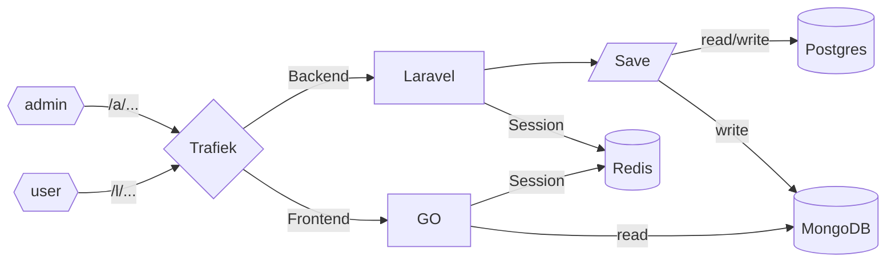

## About 

This is the frontend GO microservice that also uses Inertia to handle the frontend high load requests, loading its data from MongoDB, populated by Laravel and Postgres. Traefik will handle the routing of the frontend GO and the backend Laravel requests. It uses the same Vue files as the Laravel Job Posting project for easy development from within Laravel, also uses Ziggy to make Vue's compatible with Laravel and abstract the routes.

### Resources
- https://github.com/romsar/gonertia
- https://github.com/petaki/inertia-go
- https://github.com/chekun/golaravelsession

### Setup
- npx mix watch or mix build
- go build .
- go run .
- [http://localhost:9080/](http://localhost:9080/)

### Screenshots
- Same as other project

### TODO
- ~Build Docker compose~
- ~Wire up MongoDB~
- ~Display data from MongoDB~
- Display tag list and filter by them
- Share Redis session/login 
- Add Tests
- Move Vue in own repo for project sharing

